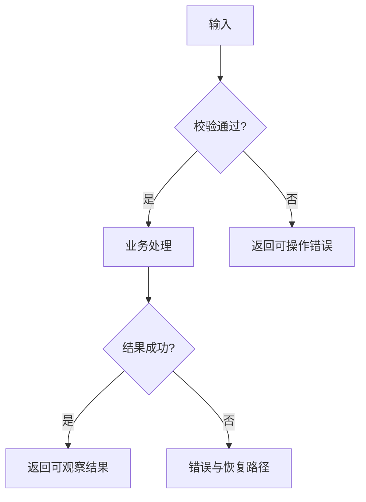

# 需求与设计文档模板

## 目录

- 通用文档元数据
- 开始编写前的必要输入
- 一页 PRD
- 产品与异常流程
- 页面与交互草图
- 技术架构
- 数据模型设计
- API 契约设计
- 决策记录
- 默认目录

## 通用文档元数据

优先遵循仓库已有元数据规范；没有约定时，Level 2-3 规划文档记录：

```markdown
- 文档 ID：DOC-001
- 状态：Draft / Proposed / Approved / Superseded / Archived
- 权威范围：
- 负责人：具体人员或 Unassigned
- 推荐维护角色：
- 来源需求：链接、Issue、用户确认或会议记录
- 上游文档：
- 下游文档或任务：
- 替代/被替代：
- 最后更新：YYYY-MM-DD
```

遵循仓库已有 front matter、标题和索引方式，不为了添加元数据破坏 OpenAPI、Proto 等规范格式。

用户提供的背景和规则可标记为 `Confirmed`，但新生成的文档默认是 `Draft` 或 `Proposed`。只有用户明确接受当前确切版本后才能改为 `Approved`；不得把模型新增的业务规则或设计取舍伪装成用户已批准事实。

## 开始编写前的必要输入

只在 `references/workflow-stages.md` 的文档就绪检查通过后使用以下模板。除通用必要信息外，确认对应输入：

| 文档 | 必要输入 |
|---|---|
| PRD | 真实问题、目标/非目标、用户角色、核心场景、业务规则、范围和可验证验收标准 |
| 产品或异常流程 | 起点与终点、参与角色、正常路径、关键分支、失败/恢复语义 |
| 页面与交互草图 | 页面目的、目标角色、信息和操作、页面关系、适用状态与权限差异 |
| 技术架构 | 当前实现证据、目标能力、系统边界、关键约束、接口/数据落点和质量要求 |
| 数据模型 | 核心实体、数据来源与所有权、生命周期、约束、隐私/保留以及迁移/回滚要求 |
| API 契约 | 调用方或消费者、输入输出语义、认证权限、错误语义、兼容策略和权威契约位置 |

缺少会改变需求或设计含义的输入时，返回 `CLARIFY`，不得用空模板、`TBD`、`Assumption` 或看似合理的字段和流程补齐。只有文档名称、排版、编号或仓库既有目录等非实质事项可以采用默认值并说明依据。

## 一页 PRD

Level 2 的中型功能和 Level 3 任务按需使用：

```markdown
# [功能名] 一页 PRD

## 背景与问题
## 目标
## 非目标
## 用户与角色
## 核心场景
## 功能需求
## 关键业务规则
## 异常与边界
## 验收标准
- Given [前置条件]，When [操作]，Then [可观察结果]。
## 风险与待确认事项
## 关联设计与任务
```

把验收标准写成可观察的界面行为、接口响应、数据状态、错误处理或兼容性结果。不要把未经确认的技术偏好伪装为产品需求。

## 产品与异常流程

根据任务选择用户流程、页面跳转、状态机、时序图、服务调用链或数据流水线。覆盖：

- 正常路径和关键分支。
- 权限差异和角色边界。
- 空、加载、成功和错误状态。
- 失败、重试、取消和回滚路径。
- 输入到持久化或输出的数据路径。



按项目事实替换节点，不保留模板中的虚构流程。

## 页面与交互草图

仅在涉及 UI 时创建低保真草图，表达页面区域、信息层级、操作入口、字段、权限、页面关系、错误/空/加载状态和响应式差异。

```text
+--------------------------------------------------+
| 页面标题                              [主操作]    |
+----------------------+---------------------------+
| 导航/筛选            | 内容区                    |
|                      | [加载/空/错误/正常状态]   |
+----------------------+---------------------------+
| 反馈、帮助与恢复操作                             |
+--------------------------------------------------+
```

遵循项目已有设计系统；不要输出视觉精稿或虚构无关页面。

## 技术架构

```markdown
# 技术架构

## 当前架构与证据
## 目标能力与约束
## 模块职责和需求落点
## 数据与调用流
## 接口、事件和协作边界
## 推荐方案及理由
## 替代方案与未选原因
## 故障点与可观测性要求
## 兼容、发布和回滚设计
## 待执行任务和待验证假设
```

设计最小充分方案，不为简单功能引入无必要的新抽象、微服务、事件系统或依赖。只描述实施建议，不创建实现文件。

## 数据模型设计

任务涉及持久化、状态模型或缓存时记录：

| 实体/字段 | 类型 | 必填/可空 | 默认值 | 约束/索引 | 所有权与生命周期 | 校验/隐私 |
|---|---|---|---|---|---|---|

补充实体关系、兼容性、历史数据、迁移顺序、回滚和恢复策略。分析双写、回填、共存窗口、大表风险、敏感数据最小化、保留期、访问控制和审计。

这里产出数据模型与迁移设计，不修改 ORM 模型、数据库 Schema 实现或迁移脚本。

## API 契约设计

```markdown
# API 契约设计

## 契约定位
- 类型：内部 / 外部
- 方法与路径（或 RPC/事件名）：
- 认证与权限：

## 请求
- Path / Query / Header：
- Body、类型和校验：
- 示例：

## 响应
- 成功结构与状态码：
- 错误码、错误结构和示例：

## 运行语义
- 幂等性、分页、限流：
- 超时、重试和一致性：

## 兼容与可观测性
- 版本策略：
- 日志、指标和追踪要求：
```

优先更新现有权威 OpenAPI、Proto 或 Schema。机器可读契约的实际写入必须获得单独批准；不得随后运行代码生成或修改消费者。

## 决策记录

对会影响多个文档或执行任务的关键选择使用：

```markdown
## 决策 [编号]：[标题]
- 状态：Proposed / Approved / Superseded
- 背景与约束：
- 决定：
- 理由：
- 替代方案：
- 影响的文档和任务：
- 需要重新评估的条件：
```

## 默认目录

优先使用仓库已有结构。没有约定时：

```text
docs/
  plans/
    <level-1-task>.md
  planning/
    <level-2-or-3-task>/
      index.md
      requirements.md
      flows.md
      architecture.md
      data-model.md
      api-contract.md
      impact-and-roadmap.md
      verification-plan.md
      decisions/
        DEC-001-<slug>.md
      tasks/
        index.md
        TASK-001-<slug>.md
```

只创建适用文件；不要为了匹配目录示例生成空文档。Level 2-3 的索引不可省略，但可以复用仓库已有权威索引。详细规则见 `references/document-package-and-traceability.md`。
